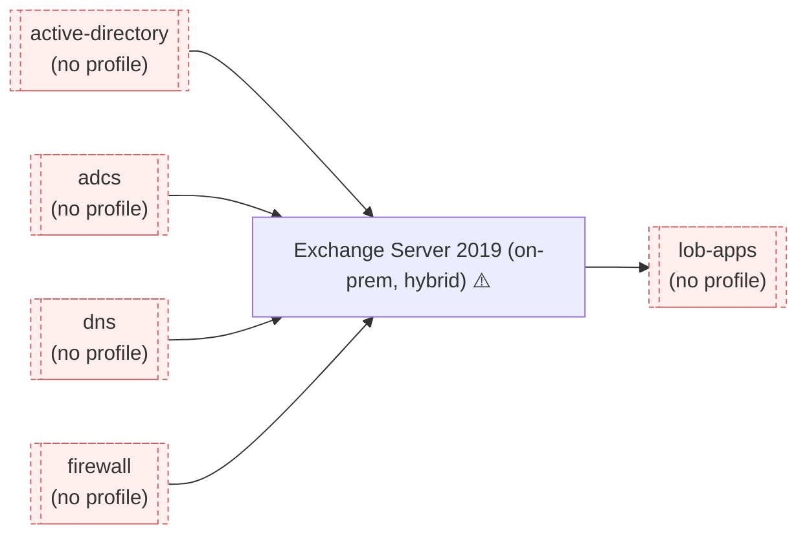

<!-- GENERATED by bin/pkm map — do not hand-edit. -->
# Environment map

Arrows point **from a dependency to the thing that needs it**: `A --> B` means
*B breaks when A breaks*. Trace downstream to answer "what does this take out?";
trace upstream to answer "what could be causing this?".

## Blast radius — if X fails, what else does

| System | Directly breaks | Total downstream |
|--------|-----------------|------------------|
| `firewall` | `exchange` | **2** — `exchange`, `lob-apps` |
| `dns` | `exchange` | **2** — `exchange`, `lob-apps` |
| `adcs` | `exchange` | **2** — `exchange`, `lob-apps` |
| `active-directory` | `exchange` | **2** — `exchange`, `lob-apps` |
| `exchange` | `lob-apps` | **1** — `lob-apps` |

## Single points of failure (≥2 downstream)

- `active-directory` → 2 systems
- `firewall` → 2 systems
- `dns` → 2 systems
- `adcs` → 2 systems

## No recorded upstream dependencies

_Either genuinely standalone, or the profile is incomplete — usually the latter._

_none_

## ⚠️ Named as a dependency but has no profile

_These are blind spots: something you support depends on them and you have no notes._

- `active-directory` — `bin/pkm new system active-directory "..."`
- `adcs` — `bin/pkm new system adcs "..."`
- `dns` — `bin/pkm new system dns "..."`
- `firewall` — `bin/pkm new system firewall "..."`
- `lob-apps` — `bin/pkm new system lob-apps "..."`
